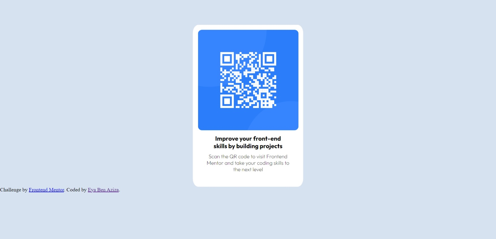

# Frontend Mentor - QR code component solution

This is a solution to the [QR code component challenge on Frontend Mentor](https://www.frontendmentor.io/challenges/qr-code-component-iux_sIO_H). Frontend Mentor challenges help you improve your coding skills by building realistic projects. 

## Table of contents

- [Overview](#overview)
  - [Screenshot](#screenshot)
  - [Links](#links)
- [My process](#my-process)
  - [Built with](#built-with)
  - [What I learned](#what-i-learned)
  - [Continued development](#continued-development)
- [Author](#author)


**Note: Delete this note and update the table of contents based on what sections you keep.**

## Overview

### Screenshot



### Links

- Solution URL: [Add solution URL here](https://github.com/Eya-ben-aziza/QR_code_Front_Mentor.git )
- Live Site URL: [Add live site URL here](https://eya-ben-aziza.github.io/QR_code_Front_Mentor/)

## My process

### Built with

- Semantic HTML5 markup
- CSS custom properties
- Desktop-first workflow
- [Styled Components](https://fonts.googleapis.com) - For styles


### What I learned
```css
I learned how to center an element using the transform property: 
.block {
    transform: translateX(-50%);
}
```


I leaned how to add a simple responsiveness for different screen sizes
```css
@media (max-width: 768px) {
    .block {
        margin-top: 20%;
        
    }
}

@media (max-width: 480px) {
    .block {
        margin-top: 50%;
    }
}
```


### Continued development

responsiveness

## Author
- Frontend Mentor - [@Eya-ben-aziza](https://www.frontendmentor.io/profile/Eya-ben-aziza)


